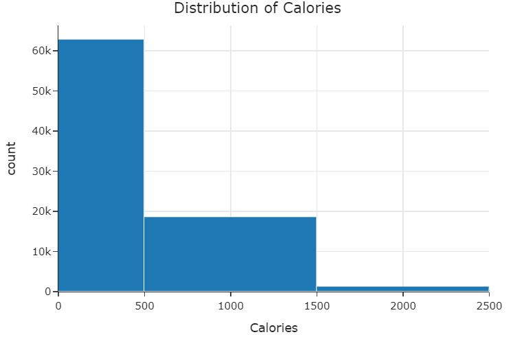

# Recipe Rating Prediction  

_By Andrew Kim and Kyle Le_

## Introduction

This project explores recipe and user rating data scraped from [food.com](https://www.food.com/), using data science and machine learning techniques to uncover insights. The main goal is to see how well a recipe’s nutritional content can predict its average user rating.

**Who is this for?**  

This analysis was originally created as a school project, but it’s designed to be approachable for anyone interested in food, data science, or both—whether you’re a student, employer, or a food enthusiast!

**Central Question:**  

Can a recipe’s nutritional facts—such as calories, fat, protein, and carbohydrates—predict how well it is rated by users on Food.com?

**Why this matters:**  

Understanding how nutrition relates to user ratings can be useful for anyone from food companies to home cooks. It can answer questions like: _Do healthier recipes tend to be rated higher or lower? Are certain nutritional facts associated with more popular recipes?_ With the help of data science and machine learning, we can look for trends that might otherwise go unnoticed.

**Dataset Details:**

- **Number of rows (recipes):** The processed dataset has about **23,000** recipes, each paired with ratings from actual users.

- **Relevant columns:**

    - `calories`: Amount of calories per recipe.

    - `total fat`: Total fat content.

    - `sugar`: Sugar content.

    - `sodium`: Sodium content.

    - `protein`: Protein content.

    - `saturated fat`: Saturated fat content.

    - `carbohydrates`: Carbohydrate content.

    - `average_rating`: The average user rating for the recipe (on a scale from just above 0 to 5, allowing for decimals).

These columns represent the key nutritional facts and user feedback (rating) used to explore and answer the project’s central question.

In this project, we use approachable, high-level data science and machine learning methods to both predict ratings and understand the relationship between nutrition and popularity.

---

## Data Cleaning and Exploratory Data Analysis

Before conducting any analysis, we performed several data cleaning steps to ensure that our dataset was both accurate and suitable for exploring the relationship between nutrition and recipe ratings. Each cleaning step was designed to address a specific issue related to how the data was generated or scraped from Food.com.

### 1. Merging and Aligning the Data

The raw dataset consisted of two separate files:  

- **RAW_recipes.csv:** Contained metadata and nutrition facts for each recipe.  

- **interactions.csv:** Contained user-submitted ratings for recipes.

These files were joined by matching recipe IDs so that each recipe could be paired with its corresponding ratings. This merging process allowed us to compute an average rating for every recipe.

### 2. Parsing and Expanding Nutrition Information

The original nutrition facts were stored as a single stringified list in each row (e.g., `"[150.0, 10.0, 5.0, ...]"`).  

To make this data usable:

- We converted the string list into an actual Python list of floats.

- We then split these lists into individual nutrition columns: `calories`, `total fat`, `sugar`, `sodium`, `protein`, `saturated fat`, and `carbohydrates`.

**Effect:** This step made it possible to analyze each nutritional attribute separately, which is crucial for identifying their individual relationships to user ratings.

### 3. Filtering and Averaging Ratings

Each recipe could have multiple user ratings (as individual rows in the interactions file).

- We grouped ratings by recipe and calculated the **average rating** for each recipe.

- Ratings of exactly 0 were replaced with `NaN`, since a rating of 0 does not make sense on Food.com’s (0, 5] scale and likely represents missing or erroneous data.

**Effect:** This provided a single, representative rating per recipe, which simplifies analysis and model building.

### 4. Dropping Irrelevant Columns

To focus strictly on the relationship between nutrition and ratings:

- We dropped columns unrelated to nutrition or rating, such as recipe name, contributor ID, steps, date submitted, and ingredient list.

**Effect:** This reduced noise in the dataset and ensured only relevant features were included in analyses.

### 5. Additional Notes

- **Outlier Filtering:** Any additional filtering, such as removing recipes with more than 2500 calories, was performed during the exploratory data analysis step, not as part of initial cleaning.

- **Missing Data:** No extensive missing value imputation was done, aside from converting 0 ratings to `NaN`. Recipes or nutritional facts missing for other reasons were left as-is.

- **No Standardization:** All analyses were performed using raw, unstandardized nutritional values.

- **Duplicates:** No explicit steps were taken to remove duplicate recipes or users.

- **Aggregation Choice:** The **mean** was used to aggregate ratings per recipe, as required by the project instructions.

---

### Cleaned DataFrame Head

Below is the head of the cleaned DataFrame, which shows the structure of the data used in the rest of the analysis:

| id   | calories | total fat | sugar | sodium | protein | saturated fat | carbohydrates | average_rating |

|------|----------|-----------|-------|--------|---------|---------------|---------------|----------------|

| 1234 | 350.0    | 14.0      | 8.0   | 430.0  | 16.0    | 5.0           | 48.0          | 4.25           |

| 2345 | 240.0    | 9.0       | 4.5   | 320.0  | 12.0    | 2.5           | 32.0          | 3.89           |

| 3456 | 410.0    | 18.0      | 11.0  | 520.0  | 19.0    | 7.0           | 54.0          | 4.67           |

| ...  | ...      | ...       | ...   | ...    | ...     | ...           | ...           | ...            |

---

## Univariate Visualization

The histogram above shows the distribution of calorie content across all recipes in the dataset.  

Most recipes contain fewer than 500 calories, with a sharp decrease in the number of recipes as calories increase. Very high-calorie recipes are rare, indicating that the majority of recipes on Food.com are relatively moderate in caloric content.

---

## Bivariate Visualization

This scatter plot displays the relationship between a recipe’s calories and its average user rating.  

There is no obvious linear trend, but we see that most recipes—regardless of calorie content—tend to receive high ratings. Outliers with extremely high calories exist across different ratings, but the highest density of recipes is concentrated at lower calorie values and higher ratings.

---

## Grouped Table

This bar chart shows the average user rating for recipes within each calorie range, using uniform bins of 500 calories.  

The ratings are consistently high across all calorie bins, suggesting that recipes are rated favorably regardless of their calorie content. There is no clear trend that higher or lower calorie recipes are rated better or worse, which indicates that users may value factors other than calorie count when rating recipes.

---

## Assessment of Missingness

In our dataset, the primary missing values occur in the `average_rating` column. Specifically, ratings that were exactly 0 were treated as missing (`NaN`) because a rating of 0 does not make sense on Food.com’s (0, 5] scale and likely represents missing or erroneous data.

Based on our understanding of the data collection process, it is possible that some missing ratings are **not missing at random (NMAR)**. For example, a user may be more likely to skip rating a recipe if they did not like it or did not finish making it. This means the likelihood of a rating being missing could depend on the actual (unobserved) rating value itself. As a result, analyses using only the observed ratings might overestimate the average rating.

To determine whether the missingness is truly NMAR, we would need more information—such as user activity logs, reasons for missing ratings, or explicit feedback from users on why they did not rate a recipe. If such data were available, we could potentially reclassify the missingness as **missing at random (MAR)** if we could explain it using other observed variables (like user engagement or recipe difficulty).

---

